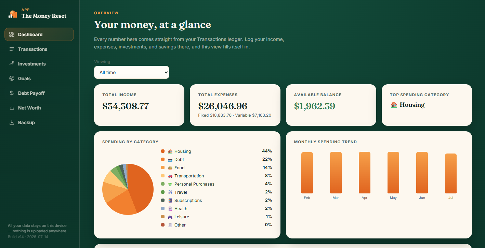
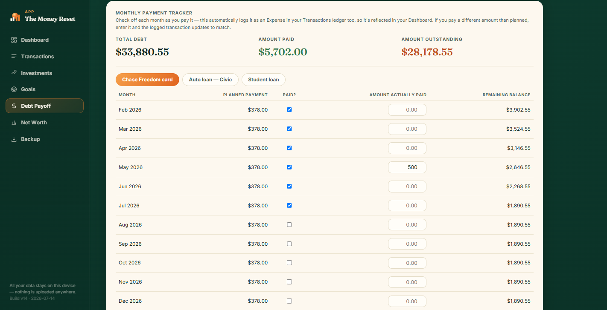
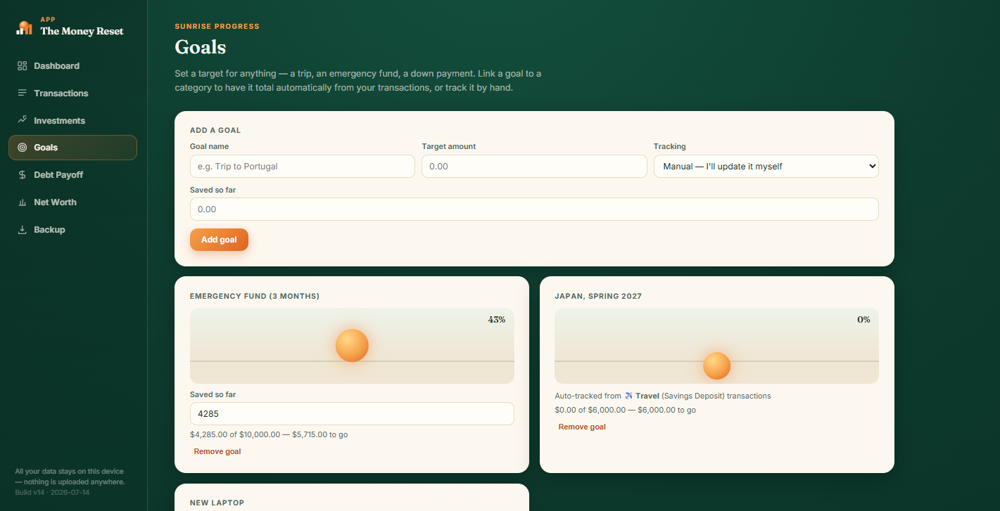
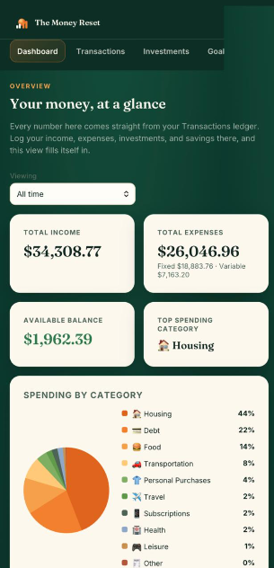

# The Money Reset — Case Study

> A personal finance application built as a single, self-contained HTML file.
> No backend, no build step, no framework, no dependencies.

**[The product →](https://the-moneyreset.netlify.app/)** · Source code is private (commercial product)

---

## TL;DR

A paid personal finance product for the US market, shipped as one HTML file that runs entirely in the browser. Fourteen builds, two Safari-only bugs that turned out to be the same mistake made twice, and a security audit that found the access gate I had shipped was decorative — which led to rebuilding it around AES-256-GCM with the decryption key derived from the customer's code.

This repository documents the engineering decisions. The product source is closed.

---

## Screenshots

*Demo data. The app ships empty; nothing here is a real person's finances.*

| | |
|---|---|
|  |  |
| **Dashboard** — totals, category breakdown, and monthly trend, all derived from the transaction ledger. Nothing on this screen is entered directly. | **Debt payoff** — Snowball ordering with a per-month tracker. Checking a month off writes the matching expense into the ledger; the planned amount for that month is then frozen. |
|  |  |
| **Goals** — manual or auto-tracked from a linked category and flow. The sunrise fills as the target approaches. | **Mobile** — same single file, no separate build. Safari on iOS, which is where both cross-engine bugs below were found. |

---

## The problem

Personal finance tools fall into two buckets, and both fail the same user:

- **Spreadsheets** — infinitely flexible, but the user has to build the system before they can use it. Most abandon it in week two.
- **SaaS apps** — polished, but require an account, a subscription, and handing bank-level data to a third party.

The gap: someone who wants structure without a subscription, and privacy without building it themselves.

I had already built this system for myself — a spreadsheet model feeding a Power BI dashboard, processing statements from three banks. It worked, and it was unshippable: it required Excel, Power BI, and the willingness to maintain a data model. The product question was whether the *logic* could survive being separated from the tooling.

---

## Constraints I imposed

Chosen before writing code. Every later decision traces back to one of them.

| Constraint | Reason |
|---|---|
| **Single HTML file** | The user receives one artifact. There is no wrong way to install it — no server, no folder structure to preserve, no broken relative path. |
| **Zero backend** | No hosting cost, no uptime obligation, no database to breach. A product with no server cannot leak user data. |
| **User data never transmitted** | Financial entries live in `localStorage` and are never sent anywhere. This is verifiable in the browser's network tab rather than something the user has to take on faith. *(Caveat, honestly stated: the current build still fetches two web fonts from a third party. No user data is in that request, but it is a request. See "what I'd do differently.")* |
| **No build step** | The file I edit is the file the customer runs. No transpilation, no bundler version rot. |
| **No dependencies** | Nothing to CDN-fetch, nothing to go stale, nothing to get abandoned upstream. |

The cost of these constraints was real and is discussed below.

---

## Architecture

```
index.html
├── <style>   design system, layout, print styles
├── <body>    lock screen + app container
└── <script>
    ├── access layer    — decrypts and injects the app
    ├── state layer     — schema-versioned localStorage wrapper
    ├── domain layer    — budgeting, debt payoff, goals, net worth
    └── render layer    — view functions, no framework
```

Seven sections: Dashboard, Transactions, Investments, Goals, Debt Payoff, Net Worth, and Backup & Restore.

**State.** All data lives in `localStorage` under versioned keys, behind a single wrapper. Nothing touches the storage API directly. That wrapper owns schema migration — when the data shape changed between builds, existing users' data was migrated forward on load rather than wiped. This is the piece worth extracting and open-sourcing, because it's what made shipping fourteen builds to real users survivable.

**Rendering.** Plain DOM manipulation. State changes call an explicit re-render for the affected view. More code than a framework would need, and the correct trade at this size — the entire app is smaller than React's runtime.

**Currency.** Monetary values are stored as integers. Floating-point arithmetic is never applied to money. Formatting happens only at the render boundary.

**Debt payoff.** Both Snowball and Avalanche strategies, with planned amounts snapshot-locked at the moment a plan is created, so recalculating the projection doesn't silently rewrite what the user committed to last month. Monthly payments auto-sync into the transaction ledger.

---

## Deep dive: I audited my own access gate and it was decorative

This is the most useful thing in this repository, because the failure was invisible from the outside.

**What I shipped.** Access codes in the format `TMR-XXXX-YYYY`, where `YYYY` was a checksum computed from `XXXX` and a salt. Any code matching the pattern with a correct checksum was accepted. The app payload was encrypted with AES-GCM. On paper: unlimited unique per-customer codes, real encryption, no server, no code list.

**What I found when I audited it.** Two independent failures, either of which was fatal:

1. **The access code never touched key derivation.** The decryption key was derived entirely from constants hardcoded in the file. The code only controlled UI flow — it decided whether to *call* the decrypt function, never what that function did. Anyone could open the console and call the decryption directly, with no code at all, and get the plaintext app back.

2. **The checksum algorithm and its salt were both in the file.** Anyone reading the source could generate unlimited valid codes.

The encryption was cryptographically sound and completely load-bearing on nothing. It looked like security to me *because I had written it*, and I only saw it when I sat down and traced the actual data flow from input to key.

**What replaced it.**

| | Before | After |
|---|---|---|
| Key derived from | hardcoded constant | the customer's access code |
| Plaintext app in file | encrypted, but decryptable by anyone | absent — ciphertext only |
| Wrong code produces | UI rejection, app still extractable | failed GCM authentication, nothing revealed |
| Code validation | client-side checksum, forgeable | decryption succeeds or it doesn't |

Concretely: AES-256-GCM; key derived via PBKDF2-SHA256 at 600,000 iterations (OWASP's current guidance) with a random 16-byte salt per build; random 12-byte IV per encryption; codes generated from `crypto.getRandomValues` over a Crockford Base32 alphabet, 18 characters — 90 bits of entropy, with no modulo bias because 256 is a multiple of 32.

There is no code list and no checksum. The only thing that unlocks the app is a code that correctly decrypts the payload. `view source` reveals the PBKDF2 parameters and nothing else.

**Where it still fails, stated plainly.** After unlock, the decrypted app is in the DOM. A paying customer can open DevTools and reconstruct a plaintext copy. No client-side scheme fixes that — it's the ceiling of the deployment model, not a bug to file. The scheme protects against *someone who has the file but didn't buy a code*. It does not protect against a customer who chooses to share.

**The transferable lesson.** "It uses AES" is not a security property. The question is what the key is derived from and what an attacker actually needs to supply. I had the right primitive wired to the wrong input, and the only thing that surfaced it was tracing the flow instead of reviewing the parts.

**A supporting tool** — a local, browser-based utility that migrates a build from the old scheme to the new one, re-encrypts the payload under a fresh code, patches the gate, and round-trip verifies before emitting the file — is published separately.

---

## Deep dive: two Safari bugs, one root cause in my process

These were found nine months apart, in unrelated parts of the codebase. They look like different bugs. They are the same mistake.

### Bug 1 — layout collapse

**Symptom.** The app rendered correctly in Chrome and Firefox on every platform. On Safari — reproduced on an iPhone 14 Pro — the layout collapsed.

**Why it was hard to find.** It was invisible on desktop Safari at wide viewports and on every emulated Chrome device profile. The trigger required both the mobile breakpoint and Safari's engine. Testing "on mobile" in Chrome DevTools reproduced nothing, which is exactly why it survived several builds.

**Root cause.** A wrapper using `display: contents` sitting inside a flex container. `display: contents` is meant to remove an element from the box tree so its children participate directly in the parent's layout. WebKit's handling of that inside flex layout diverges from Blink and Gecko, and the children were not being laid out as flex items as intended.

**Fix.** Restructure rather than patch: the mobile navigation elements became real siblings outside the flex container instead of children of a `display: contents` wrapper. No vendor prefix, no `@supports` branch, no Safari-only stylesheet — the markup stopped depending on the disputed behavior at all.

**Verification.** Automated rendering tests via Playwright at iPhone viewport dimensions, so the fix was confirmed against actual WebKit rather than a Chrome device emulation that had already proven it couldn't see the bug.

### Bug 2 — months in alphabetical order

**Symptom.** The monthly spending chart rendered its bars in the correct chronological order on desktop Chrome. On Safari on a real iPhone, the same data with the same code produced: Apr, Feb, Jul, Jun, Mar, May.

That is alphabetical order, which is the tell. The chart wasn't misreading dates — it had stopped treating them as dates at all.

**Root cause.** Month labels were stored as display strings (`"Feb 2026"`), and the sort key was recovered by re-parsing them:

```js
const d = new Date(label + ' 1');          // "Feb 2026 1"
return isNaN(d) ? label : d.toISOString().slice(0,7);
```

`"Feb 2026 1"` is not a format the spec requires any engine to parse. Non-ISO date string parsing is implementation-defined: engines are free to accept what they like. Chrome accepts it. WebKit returns `Invalid Date`. The fallback then sorted the raw display strings, which is alphabetical.

**Why it was invisible.** The fallback is silent by design — no exception, no console warning, no missing data. The chart rendered completely and confidently, with every bar the correct height, in the wrong order. On a six-month view the shape still looked plausible. The same helper also fed the month filter dropdown, so that was mis-ordered too.

**Fix.** Stop round-tripping through `new Date` and derive the sort key from the label structurally, with an explicit fallback that sorts unparseable labels to the end rather than interleaving them.

**The deeper fix** is not the function — it's that a display string was being used as a data key. The label should never have been the thing that gets sorted. Storing `YYYY-MM` alongside the label and sorting on that removes the parse step entirely, and this is the same lesson the codebase had already learned once when category labels were doubling as data keys.

### What the two have in common

Both bugs are places where I relied on behavior the specification leaves to the implementation — `display: contents` inside flex layout, and non-ISO date string parsing — and validated against exactly one engine. Neither is exotic; both are well-documented divergences. The failure wasn't knowledge, it was method: Chrome's device emulation was standing in for Safari, and it cannot find a bug that is in the engine rather than the viewport.

One produced a visible layout collapse. The other produced a chart that looked entirely correct and was wrong. In a finance tool the second is worse, and it is the one that would have shipped indefinitely, because nothing about it looks like a bug.

**What changed in my process.** Cross-engine testing moved from "before release" to "before merging," against a real WebKit runtime rather than an emulated viewport. And silent fallbacks — `isNaN(d) ? label : ...` — are now something I treat as a code smell rather than defensive programming: a fallback that cannot be distinguished from success is a bug that will not report itself.

---

## Deep dive: the rest of the security review

The access gate was the headline, but the same audit found ordinary problems worth naming:

**Untrusted input reaching the DOM.** User-controlled strings — category names, transaction descriptions, goal labels — were written into the page through paths that interpreted them as markup rather than text. A confirmed DOM XSS. In a single-user local app the practical exploitability is low, but "low" is not "zero," and the fix was mechanical: user-controlled values go through a text-node path, never an HTML-parsing one.

**No validation at the storage boundary.** The app trusted whatever came out of `localStorage` to have the expected shape. Corrupted or hand-edited storage produced silent misbehavior rather than clean failure.

**Side effects inside calculation functions.** Functions that read as pure — "compute the payoff projection" — were mutating state as they went. This is the class of bug that makes a number wrong in a way nobody notices for months.

**Category labels doubling as data keys.** Renaming a category in the UI would have orphaned historical data.

**The generalizable lesson.** "It runs locally, single user, no server" reads like it removes the threat model. It changes it. The adversary stops being remote and becomes the user's own bad data, a corrupted storage entry, a paste from a spreadsheet, or a stale reference in your own code. Those failures are quieter and, in a finance tool, arguably worse: a security hole gets reported, a wrong number gets trusted.

---

## What shipping actually required

The code was roughly half the work.

- **Two language builds.** English for the US market, Portuguese for testing with real users before release, including currency formatting, month names, and category sets.
- **Real user testing.** The Portuguese build went to family members with no context on how it was supposed to work. This surfaced UX assumptions invisible to me and produced more changes than any other single input.
- **Market fit research for a market I don't live in.** This changed the product: US payment methods (Zelle, Venmo, Cash App, direct deposit) replaced a generic "bank transfer" field, and two missing budget categories — Housing and Health/Medical — were added. I would not have guessed either from Brazil.
- **Support surface.** User guide, delivery templates, hosting instructions. A product that ships as a file needs documentation a hosted app gets for free.

---

## What I'd do differently

The honest section.

**The no-build-step constraint didn't survive localization.** Two language builds meant two files diverging by hand. Every fix had to be applied twice, and at least once it wasn't. The constraint was right for the customer and wrong for me. A minimal build emitting multiple locales from one source would have cost an afternoon and saved more than that.

**I audited too late.** The security review found problems introduced early and repeated throughout — including an access gate that had never worked. Auditing at the first user-input feature would have set the pattern before it propagated, and tracing the key derivation on day one would have saved rebuilding the gate on day forty.

**I under-tested Safari, and tested the wrong Safari — twice.** Chrome's device emulation gave me false confidence, and it did so again months after I thought I had learned the lesson. The second Safari bug was found the same way as the first: by someone opening the app on an actual iPhone. That is not a testing strategy.

**The web fonts are still a third-party request.** I designed around "nothing leaves the device" and then linked two fonts from a font CDN. No user data is in that request, but it contradicts the spirit of the constraint, breaks offline rendering, and hands a third party a signal on every open. Embedding the fonts is the fix and it is not done yet — it is listed here rather than quietly omitted.

**`localStorage` as the only persistence layer is a real product risk.** Clearing browser data destroys everything, silently. Backup and restore exist, but they are opt-in, and users who don't know they need a backup are exactly the users who lose their data. If I rebuilt this, backup would be prompted, not merely available.

---

## Stack

HTML, CSS, and JavaScript. Web Crypto API for the access layer. That's the complete list.

---

## Extracted components

Pieces of this project that are general enough to stand alone. Being cleaned up for release:

- **Build hardening tool** — migrates a build to the encrypted access scheme, re-encrypts the payload under a fresh code, and round-trip verifies before emitting the file
- **Schema-versioned localStorage wrapper** — the persistence layer, generalized
- **Cross-engine bug reproductions** — `display: contents` in flex layout, and non-ISO date string parsing

---

## About

Leonardo Zanetti — mechanical engineer (CREA), working at the intersection of engineering and software. I build internal tooling for equipment management and heavy-machinery operations, and ship digital products alongside it.

The through-line is the same in both: taking a process someone runs in a spreadsheet and turning it into something that holds its shape without them.

**[LinkedIn](https://www.linkedin.com/in/leonardo-camargo-zanetti-289585185)** · **[leoczanetti@gmail.com](mailto:leoczanetti@gmail.com)**
